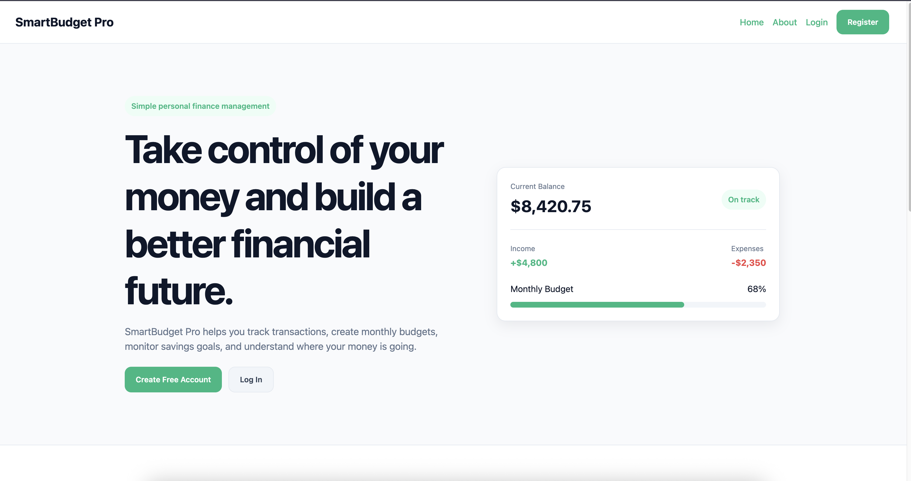
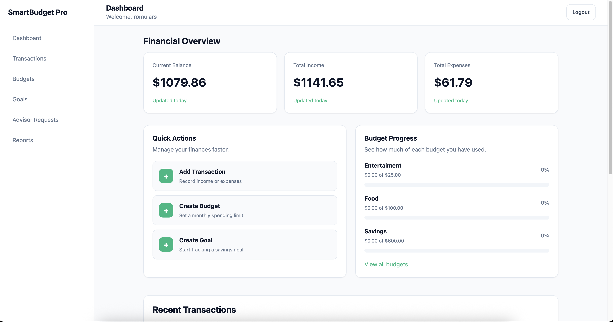

# SmartBudget Pro

SmartBudget Pro is a full-stack personal finance and budgeting platform built with Node.js, Express.js, EJS, and PostgreSQL.

The application allows users to manage transactions, create budgets, track financial goals, and interact with financial advisors through a multi-stage approval workflow system.

This project is being developed as the final project for CSE 340 Web Backend Development and is designed to demonstrate modern backend development practices including MVC architecture, authentication, authorization, relational database design, server-side rendering, and production deployment.

---

## 📸 Application Preview

### Landing Page



---

### User Dashboard



---

# Features

## Authentication and Authorization

* Session-based authentication using express-session
* Password hashing with bcrypt
* Multiple user roles:

  * Admin
  * Financial Advisor
  * Standard User

---

## Financial Management

* Income and expense tracking
* Budget management
* Category-based transactions
* Financial analytics dashboard

---

## Financial Goal Workflow

Users can:

* Create financial goals
* Submit goals for review
* Track approval status

Advisors and admins can:

* Review goals
* Leave advisor notes
* Approve or reject submissions
* Update workflow statuses

---

# Technology Stack

## Backend

* Node.js
* Express.js
* PostgreSQL
* EJS
* express-session
* bcrypt

## Frontend

* EJS server-side rendering
* Tailwind CSS
* React components for interactive dashboard widgets

---

# Architecture

The project follows MVC (Model-View-Controller) architecture.

```text
src/
├── controllers/
├── database/
├── middleware/
├── models/
├── public/
├── routes/
├── utilities/
└── views/
```

---

# Project Goals

This project is intended to demonstrate:

* Relational database design
* Authentication and authorization
* Secure backend development
* Dynamic server-side rendering
* Multi-stage workflow systems
* Production-ready deployment practices

---

# Planned Features

* Admin dashboard
* Advisor review queue
* User analytics dashboard
* Financial reports
* Budget recommendations
* Goal progress tracking
* Search and filtering

---

# Installation

## Clone Repository

```bash
git clone <repository-url>
```

## Install Dependencies

Using pnpm:

```bash
pnpm install
```

## Start Development Server

```bash
pnpm dev
```

---

# Environment Variables

Create a `.env` file in the project root:

```env
PORT=3000
DATABASE_URL=your_database_url
SESSION_SECRET=your_secret
```

---

# Development Status

Currently in active development.

Sprint 0 completed:

* Initial architecture planning
* MVC folder structure
* Project setup
* README initialization

---

# Author

Laulin Vasquez